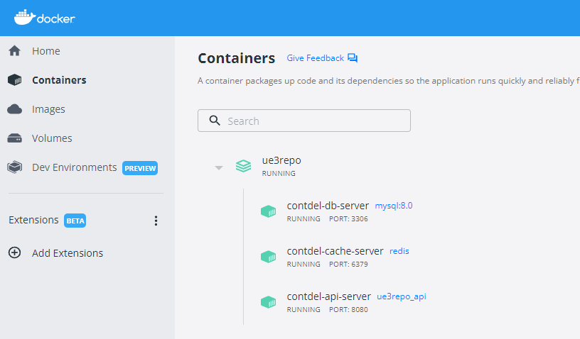
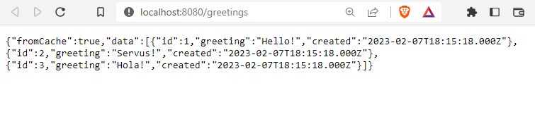
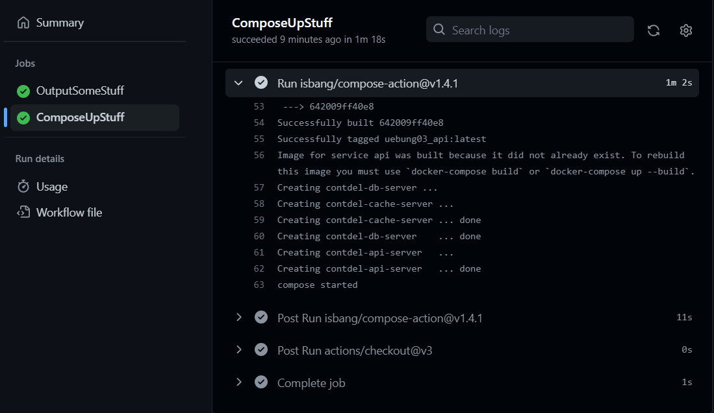
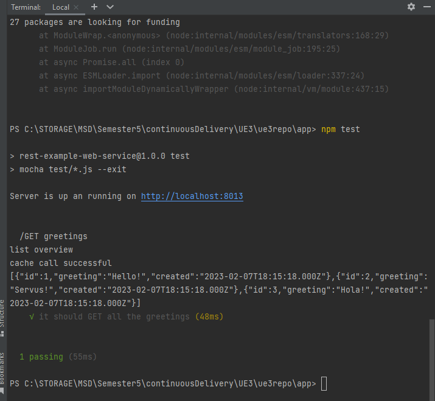
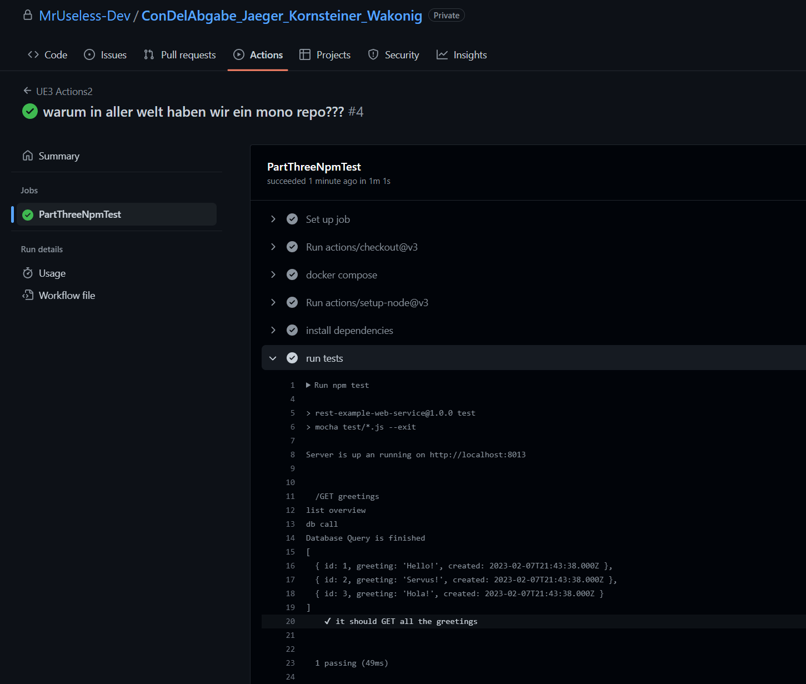

#Documentation for 3rd assignment for Wakonig, Kornsteiner and Jaeger

###The containers running locally:

###The service accessible via localhost:

###docker compose up working through pipeline:

###npm test executed locally:

###The github action executing npm test successfully:

